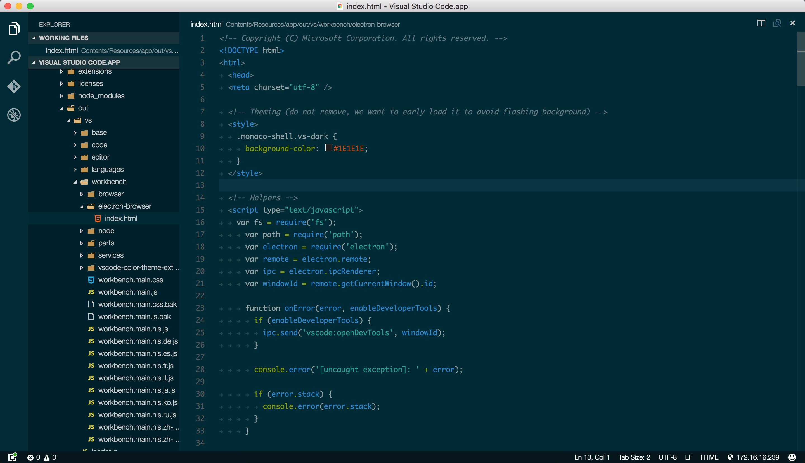
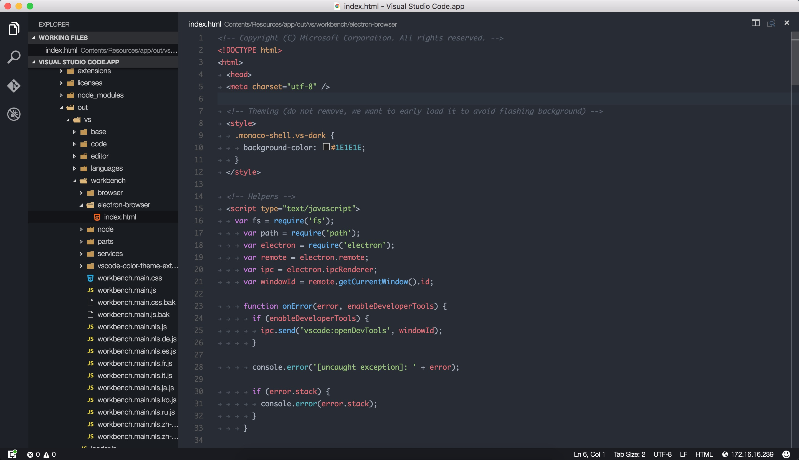

# vscode-color-theme-extension

## Preview

Solarized Dark


One Dark


## Usage

At first, you should change color theme to Solarized Dark or One Dark.

### Using Git

Clone the repository using the command below:

```
cd /Applications/Visual\ Studio\ Code.app/Contents/Resources/app/out/vs/workbench/

git clone https://github.com/wangchi/vscode-color-theme-extension vscode-color-theme-extension
```

### Activating the theme

Open VS Code sourse code:

Mac OS:

```
cd /Applications/Visual\ Studio\ Code.app/Contents/Resources/app/out/vs/workbench/electron-browser

vi index.html
```

Then append `link` tag to `head`, such as:

```
...
<head>
...
  <link rel="stylesheet" type="text/css" href="file:///Applications/Visual%20Studio%20Code.app/Contents/Resources/app/out/vs/workbench/vscode-color-theme-extension/color-theme-extension.css">
</head>
...
```

### Restart

Restart VS Code, the color theme extension will effective.

## Others

### Recommend settings

Maybe the following config will help your.

```
{
  /* base */
  "editor.fontFamily": "Monaco",
  "editor.fontSize": 13,
  "editor.lineHeight": 22,
  "editor.tabSize": 2,
  "editor.insertSpaces": true,
  "files.trimTrailingWhitespace": true,
  "editor.renderWhitespace": true,

  /* close VS Code`s verification，using ESLint or JSHint */
  "javascript.validate.enable": false
}
```

### Issues

If you have some problems, you can create an issue: [https://github.com/wangchi/vscode-color-theme-extension/issues](https://github.com/wangchi/vscode-color-theme-extension/issues)

## License

[MIT License](./LICENSE)